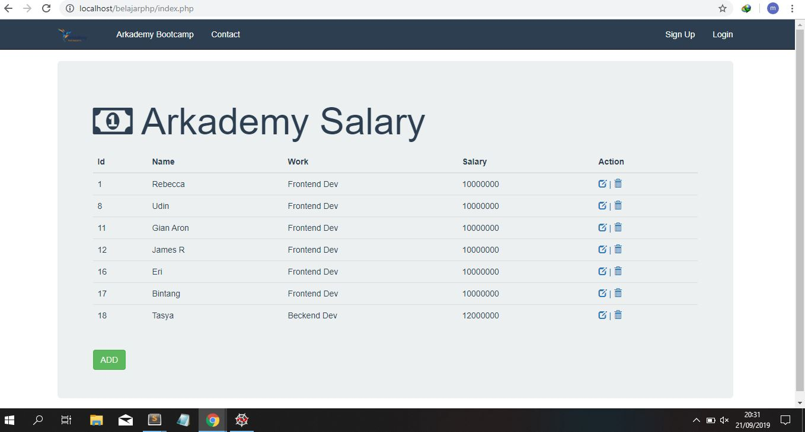
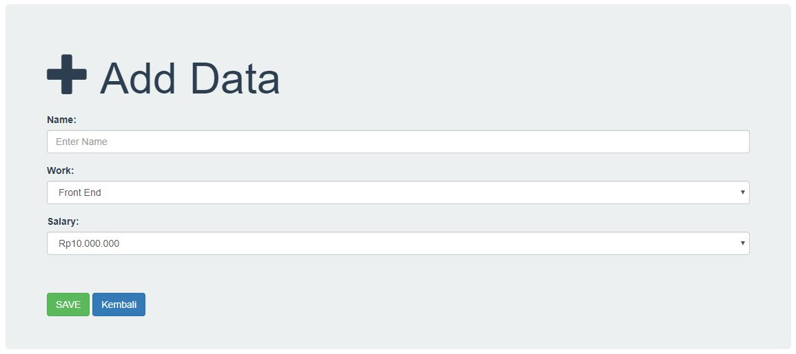
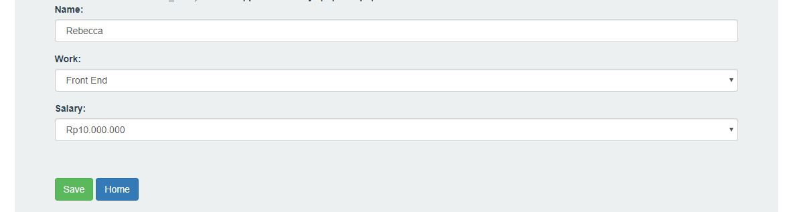
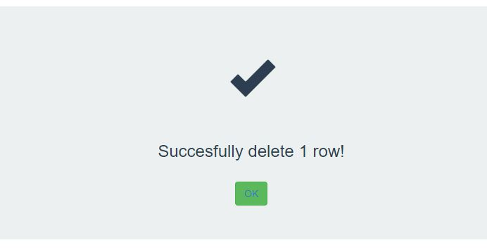

# Arkademy Bootcamp
 
Jawaban Test Muhammad Miftahuddin Ghofur

# Keterangan :
--------------------------------------------------------------------------------------
<h1>nomer 1 : </h1>
<h3>Menggunakan bahasa pemrograman php </h3>
 
<h1> nomer 2 : </h1>
<h3>Menggunakan validasi Pregex bahasa pemrograman Javascript </h3>
 
<h1>#nomer 3 : </h1>
<h3>Menggunakan python perulangan untuk mencari jumlah jabat tangan yang terjadi</h3>
 
<h1>#nomer 4 : </h1
<h3>Menggunakan Pyhton 3 untuk memunculkan deret fibonaci</h3>
 
<h1>#nomer 5 : </h1>
<h3>Menggunakan Python 3 untuk mencari total Mie yang di dapatkan dari tanggal dan jumlah uang tertentu</h3>

<h1> #No 6 : </h1>
menggunakan bahasa PHP . dijalankan di localhost
 sebelum menjalankan, import database arkademy.sql 

Halaman utama adalah index.php
  Tampilan : 
   

Halaman Tambah Data adalah tambahdata.php
  dengan meng-klik tombol "ADD" maka akan muncul halaman tambah data
  Tampilan : 
   
  Masukan Data dan tambahkan

Halaman Update adalah edit.php
  dengan meng-klik tombol "EDIT" di kolom Action maka akan muncul halaman Edit Data
  Tampilan : 
   
  Ganti data dan simpan

Halaman Hapus adalah hapus.php
  dengan meng-klik tombol "Delete" pada kolom Action maka data yang di pilih akan terhapus
  Tampilan : 
   
  Data berhasil dihapus!

